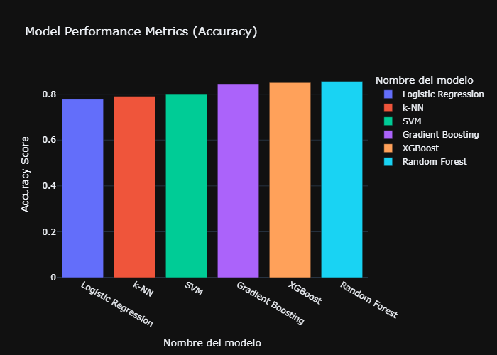

# Predicción del abandono de clientes 🤖


Una empresa de telecomunicaciones (Vodafone) desea estimar la probabilidad de que un cliente abandone la compañía. Este proyecto tiene como objetivo desarrollar un modelo de clasificación capaz de predecir si un cliente abandonará el servicio (**churn**) o permanecerá en la empresa.

## Descripción General del Proyecto

En este proyecto se emplean técnicas de **Machine Learning Supervisado (Clasificación)** para analizar la importancia de la analítica de abandono de clientes (*churn analytics*) como una herramienta estratégica para las empresas de telecomunicaciones. El propósito es identificar de manera proactiva los principales factores de riesgo asociados al abandono de clientes, optimizar las estrategias de retención y fortalecer las relaciones a largo plazo con los usuarios.

El proyecto sigue la metodología **CRISP-DM (Cross-Industry Standard Process for Data Mining)**, un marco de trabajo ampliamente utilizado en proyectos de minería de datos y ciencia de datos, para explorar, procesar y analizar el fenómeno del abandono de clientes dentro de la red de servicios de Vodafone.

El modelo predictivo de abandono de clientes constituye una solución basada en datos diseñada para abordar el desafío constante de la pérdida de clientes en industrias basadas en suscripciones. Su objetivo es identificar a los clientes con mayor riesgo de abandonar el servicio, permitiendo a la empresa implementar acciones preventivas y desarrollar estrategias de retención personalizadas que contribuyan a mejorar la fidelización de los clientes.

## Contenidos 📖
1. [**Requisitos**](#1)
2. [**Instalación y uso**](#2)
3. [**Variables**](#3)
4. [**Funcionamiento del script**](#4)
5. [**Resultado**](#5)
6. [**Conclusiones**](#6)
___

## 1. Requisitos ⚙️ <a id='1'></a>
Para ejecutar este proyecto únicamente se requiere:
<p align="left">


</p>

## 2. Instalación y uso 🚀 <a id='2'></a>

### 2.1. Clonar el repositorio

1. Abrir una terminal o línea de comandos Git Bash.

2. Ejecutar el siguiente comando para clonar el repositorio en tu máquina local:
```bash
git clone https://github.com/CarloEduardo/05-Prediccion-de-Abandono-de-Clientes.git
```

3. Establecer como directorio de trabajo la carpeta clonada.
```
cd \E:\07. GitHub\05-Prediccion-de-Abandono-de-Clientes\
```

### 2.1. Uso :monocle_face:

1. Abrir el archivo 
```bash
Prediccion-de-Abandono-de-Clientes.ipynb
```

2. Instalar las bibliotecas requeridas. Estas se encuentran especificadas en el archivo `requirements.txt`.
```python
import sys
!"{sys.executable}" -m pip install pyodbc python-dotenv pandas openpyxl numpy seaborn matplotlib plotly statsmodels scipy scikit-learn imbalanced-learn xgboost joblib
```

## 3. Variables :floppy_disk:<a id="3"></a>

**Descripción de variables de las bases de datos**

| **Nombre de la Variable** | **Descripción** | **Tipo de Dato** |
|---------------------------|-----------------|------------------|
| `customerID` | Contiene el identificador único del cliente. | Categórico |
| `gender` | Indica si el cliente es mujer o hombre. | Categórico |
| `SeniorCitizen` | Indica si el cliente es un adulto mayor o no (1 = Sí, 0 = No). | Numérico (entero) |
| `Partner` | Indica si el cliente tiene pareja (Sí, No). | Categórico |
| `Dependents` | Indica si el cliente tiene dependientes (Sí, No). | Categórico |
| `tenure` | Número de meses que el cliente ha permanecido en la empresa. | Numérico (entero) |
| `PhoneService` | Indica si el cliente cuenta con servicio telefónico (Sí, No). | Categórico |
| `MultipleLines` | Indica si el cliente tiene múltiples líneas telefónicas (Sí, No, Sin servicio telefónico). | Categórico |
| `InternetService` | Tipo de servicio de Internet del cliente (DSL, Fibra óptica, Sin servicio). | Categórico |
| `OnlineSecurity` | Indica si el cliente cuenta con servicio de seguridad en línea (Sí, No, Sin servicio de Internet). | Categórico |
| `OnlineBackup` | Indica si el cliente cuenta con servicio de respaldo en línea (Sí, No, Sin servicio de Internet). | Categórico |
| `DeviceProtection` | Indica si el cliente cuenta con servicio de protección de dispositivos (Sí, No, Sin servicio de Internet). | Categórico |
| `TechSupport` | Indica si el cliente cuenta con soporte técnico (Sí, No, Sin servicio de Internet). | Categórico |
| `StreamingTV` | Indica si el cliente cuenta con servicio de televisión por streaming (Sí, No, Sin servicio de Internet). | Categórico |
| `StreamingMovies` | Indica si el cliente cuenta con servicio de películas por streaming (Sí, No, Sin servicio de Internet). | Categórico |
| `Contract` | Tipo de contrato del cliente (Mensual, Un año, Dos años). | Categórico |
| `PaperlessBilling` | Indica si el cliente utiliza facturación electrónica (Sí, No). | Categórico |
| `PaymentMethod` | Método de pago del cliente (Cheque electrónico, Cheque enviado por correo, Transferencia bancaria, Tarjeta de crédito). | Categórico |
| `MonthlyCharges` | Monto cobrado mensualmente al cliente. | Numérico (decimal) |
| `TotalCharges` | Monto total cobrado al cliente. | Objeto (`object`) |
| `Churn` | Indica si el cliente abandonó el servicio o no (Sí, No). | Categórico |

## 4. Funcionamiento del script <a id="4"></a>

El script realiza automáticamente las siguientes tareas:

- Extraer datos de múltiples fuentes, incluyendo una base de datos remota en SQL Server.

- Formular la hipótesis y definir las preguntas analíticas que se buscarán responder.

- Realizar el preprocesamiento y la limpieza de los datos, así como el Análisis Exploratorio de Datos (EDA), incluyendo análisis univariado, bivariado y multivariado.

- Responder las preguntas analíticas mediante visualizaciones.

- Desarrollar y desplegar visualizaciones interactivas en Power BI.

- Balancear el conjunto de datos utilizando el algoritmo **SMOTE** para sobremuestreo (*oversampling*).

- Realizar ingeniería de características (*Feature Engineering*) y escalamiento de variables.

- Entrenar y evaluar modelos de aprendizaje automático.

- Optimizar los modelos mediante el ajuste de hiperparámetros (*Hyperparameter Tuning*).

- Realizar pruebas de predicción e implementar mejoras en el modelo.

- Presentar las conclusiones y documentar el proyecto mediante la elaboración de un artículo o informe técnico.

## 5. Resultado :bar_chart:<a id="5"></a>

<table>
    <tr>
        <th>Precisión de los Modelos Entrenados</th>
    </tr>
    <tr>
        <td></td>
    </tr>images
</table>

<table>
    <tr>
        <th>Precisión de los Modelos Entrenados</th>
    </tr>
    <tr>
        <td>
            
        </td>
    </tr>
</table>


<table>
    <tr>
        <th>Precisión de los Modelos Entrenados</th>
    </tr>
    <tr>
        <td>
            
        </td>
    </tr>
</table>


<table>
    <tr>
        <th> Accuracy Scores of trained models </th>
    </tr>
    <tr>
        <td></td>
    </tr>
</table>


## 6. Conclusiones <a id="6"></a>

- El número de meses que el cliente ha permanecido en la empresa (**tenure**) y el tipo de contrato del cliente (**Contract**) son las variables más importantes y presentan la mayor relación con el abandono de clientes (**Churn**).

- Vodafone debería fortalecer la experiencia del cliente durante los primeros meses de permanencia. El análisis muestra que entre los **5 y 10 primeros meses** los clientes presentan una mayor probabilidad de abandonar el servicio, lo que indica que la experiencia inicial es determinante. Mejorar el proceso de incorporación (*onboarding*), la calidad del servicio y brindar un soporte técnico oportuno durante este periodo puede incrementar la satisfacción y la fidelización de los clientes.

- Vodafone debería promover contratos de mayor duración. Los resultados muestran que los clientes con contratos **mensuales (Month-to-Month)** presentan una tasa de abandono significativamente mayor que aquellos con contratos de **uno o dos años**. Incentivar la contratación de planes de mayor duración mediante beneficios, promociones y un mejor soporte técnico podría reducir la tasa de abandono y fortalecer el compromiso de los clientes con la empresa.

- El ajuste de hiperparámetros (*Hyperparameter Tuning*) no siempre produce mejoras significativas en el rendimiento de los modelos.

- Utilizando una partición de **80 % para entrenamiento y 20 % para evaluación**, el modelo **Random Forest** alcanzó una precisión aproximada del **86 %** después del ajuste de hiperparámetros.

- Los métodos de **ensamble (Ensemble Methods)** presentan un mejor desempeño en tareas de clasificación en comparación con los modelos basados en un único clasificador.

## Licencia
Este proyecto está licenciado bajo la Licencia MIT. Consulta el archivo [LICENSE](/LICENSE) para más detalles.

## Autor 👨‍💻
**Carlos Eduardo Torres García**

[](https://www.linkedin.com/in/carlo4-eduardo-torres-garcia/)
[](https://x.com/Carlo4_Eduardo)

[**⬆ Volver al inicio**](#a)

---
